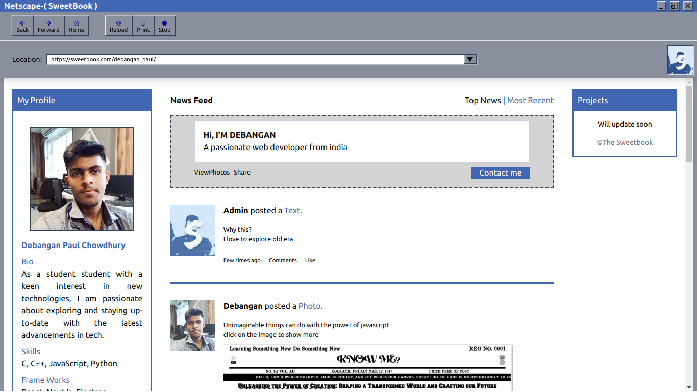

<h1>SweetBook</h1>
<h2>This book is actually My Project details</h2>
<h3>During this project i learn many concept like how social apps are really works</h3>

Link:
https://comforting-genie-d0dcfd.netlify.app/
<ol>Tools:
  <li>React</li>
  <li>Tailwind css</li>
  <li>Stock images</li>
  <li>Json</li>
</ol>

Image:

I published this project source code. So You can check and modify by your own and be creative

  
